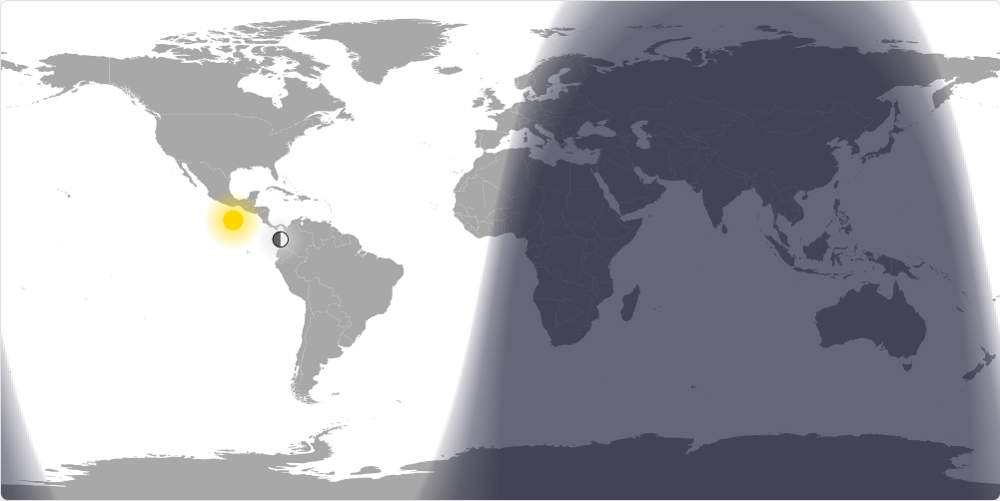

# Day/Night World Map

A real-time visualization of day and night regions across the world using accurate solar and lunar positioning calculations.



## Features

- Real-time day/night terminator line based on current UTC time
- Smooth twilight gradients showing dawn and dusk zones with professional SunCalc integration
- Solar position indicator showing where the sun is directly overhead
- Lunar position indicator showing where the moon is directly overhead with variable size based on distance
- Accurate moon phase visualization showing current illumination using SunCalc calculations
- Moon phase name and illumination percentage display
- Responsive design with normal and minimal viewing modes
- 3-column information panel showing date, sunrise/sunset times, and moon phase
- Enhanced astronomical data including solar noon, golden hour times, and moon rise/set times
- Location detection via URL parameters or HTML5 Geolocation API
- Grayscale mode optimized for e-ink displays with smooth gradient transitions
- Accurate Mercator projection using SVG world map

## Usage

- **Normal mode**: Open [lanrat.github.io/day-night-map/](https://lanrat.github.io/day-night-map/) in a web browser
- **Minimal mode**: Open [lanrat.github.io/day-night-map/?minimal](https://lanrat.github.io/day-night-map/?minimal) for a full-screen view with info bar at bottom
- **Grayscale mode**: Add `&grayscale` to any URL for optimized display on grayscale/e-ink displays (e.g., `?minimal&grayscale`)
- **Static timestamp mode**: Add `&timestamp=<unix_timestamp>` to display the map at a specific time instead of current time

### URL Parameters

All parameters can be combined and used with either query string (`?`) or hash (`#`) format:

- `minimal` - Full-screen minimal view
- `grayscale` - Optimized for grayscale/e-ink displays  
- `timestamp=<value>` - Display map at specific time (Unix timestamp in seconds or milliseconds)
- `timezone=<value>` - Display date/time in specified timezone (IANA timezone name, defaults to user's local timezone)
- `lat=<value>` - User latitude for location-based astronomical calculations (-90 to 90)
- `lon=<value>` - User longitude for location-based astronomical calculations (-180 to 180)

**Examples:**

- `?minimal&grayscale` - Minimal grayscale mode
- `?timestamp=1672531200` - New Year 2023 at midnight UTC
- `?timezone=America/New_York` - Display time in Eastern timezone
- `?timezone=Asia/Tokyo&minimal` - Tokyo time in minimal mode
- `#minimal&timestamp=1672531200000` - Minimal mode at specific time (milliseconds)
- `?minimal&grayscale&timestamp=1640995200&timezone=Europe/London` - All parameters combined
- `?lat=40.7128&lon=-74.0060` - New York City location for sunrise/sunset calculations
- `?lat=51.5074&lon=-0.1278&timezone=Europe/London` - London coordinates with local timezone

## Technical Details

The application uses the professional-grade [SunCalc library](https://github.com/mourner/suncalc) for accurate astronomical calculations combined with custom algorithms for celestial positioning. Solar and lunar positions are calculated using hybrid approaches that leverage SunCalc for complex calculations while maintaining efficient custom code for subsolar/sublunar point positioning.

### SunCalc Integration Features

- **Solar calculations**: Sunrise/sunset times, solar noon, golden hour periods, and solar elevation angles
- **Lunar calculations**: Moon phase, illumination fraction, moonrise/moonset times, and lunar distance for variable sizing
- **Location support**: Automatic geolocation detection or manual coordinates via URL parameters
- **Timezone awareness**: Display times in any IANA timezone with fallback to user's local timezone

### Rendering System

The day/night visualization uses HTML5 Canvas with optimized pixel-level rendering:

- **Twilight gradients**: Smooth transitions through astronomical, nautical, and civil twilight zones
- **Grayscale optimization**: E-ink friendly rendering with smooth gradients (not just 3-shade discrete zones)
- **Variable moon sizing**: Moon size changes based on actual Earth-Moon distance (perigee vs apogee)
- **Edge wrapping**: Celestial bodies wrap around map edges for continuous world view

### Information Panel

The 3-column solar information panel displays:

- **Date column**: Current date with day length calculation
- **Sun column**: Sunrise/sunset times with up/down arrows, plus solar noon and golden hour times
- **Moon column**: Current phase symbol and name with illumination percentage, plus moonrise/moonset times

Location-dependent calculations require either URL parameters (`lat=` and `lon=`) or browser geolocation permission. Without location data, sunrise/sunset and moon rise/set times display as "Unknown".

The map updates every minute to reflect current conditions. When using the `timestamp` parameter, the map displays a static snapshot of that specific moment and does not auto-refresh.

Inspired by [Time and Date Day and Night World Map](https://www.timeanddate.com/worldclock/sunearth.html)

## Developing

Test with

```shell
python3 -m http.server
```

Then visit [http://localhost:8000/](http://localhost:8000/)
